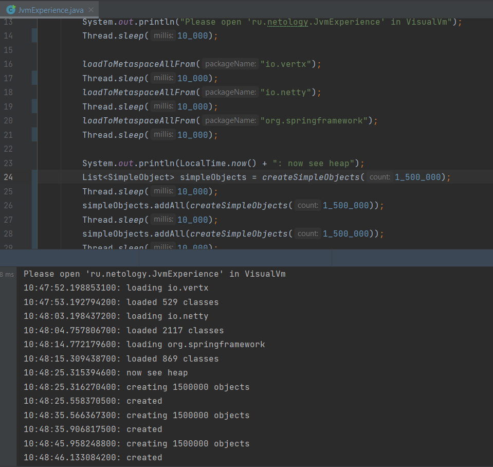
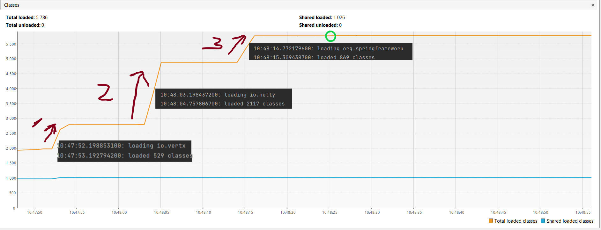
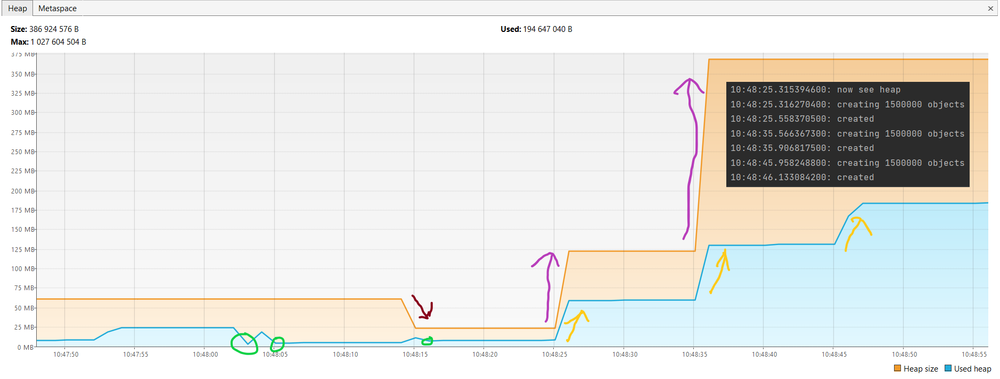
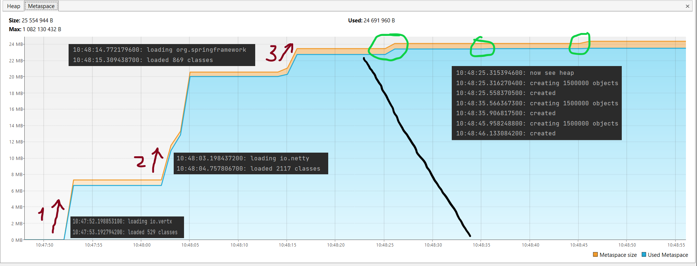

# Решение задачи "Исследование JVM через VisualVM"

## Текст кода Java с измененными данными и результат работы



## Classes

В этой части графика изображено изменение общего количества используемых классов.
Указатели "1", "2", "3" показывают, что после выполнения метода `loadToMetaspaceAllFrom()` количество используемых классов возрастает.
Зеленый круг демонстрирует нам, что при запуске метода `createSimpleObjects()` добавляется 1 метод, и последующее его использование не приводит к увеличению количество методов.

## Heap

Перед вами представлен график работы Heap. 
Красная стрелочка - указывает нам, что после очередного третьего выполнения метода `loadToMetaspaceAllFrom()` размер Heap был уменьшен программой.
Фиолетовые стрелочки - показывают нам, что размер Heap был увеличен, т.к. после начала работы метода `createSimpleObjects()` размер используемого Heap начал приближаться к пороговому значению выделенного Heap.
Зеленые круги демонстрируют нам работу сборщика мусора.
Оранжевые стрелочки - показывают нам, что используемый Heap увеличивается в процессе работы метода `createSimpleObjects()`.

## Metaspace

На этом рисунке изображен график работы Metaspace.
Указатели "1", "2", "3" показывают, что после выполнения метода `loadToMetaspaceAllFrom()` увеличивается размер Metaspace.
Зеленые круги демонстрируют нам незначительное изменение показателей используемого Metaspace после выполнения метода `createSimpleObjects()`.